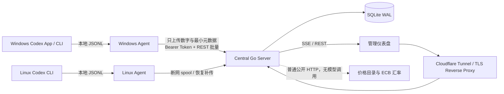

# Codex Token Meter

> 本地优先、跨平台、可核验的 Codex Token 用量仪表盘。

[](https://github.com/shaoqiangxu/codex-token-meter/actions/workflows/ci.yml)
[](https://go.dev/)
[](LICENSE)

[English](README_EN.md) · [配置说明](docs/CONFIGURATION.md) · [运维手册](docs/OPERATIONS.md) · [安全设计](docs/SECURITY.md)

Codex Token Meter 从运行 Codex CLI 或 Codex App 的 Windows/Linux 主机读取本地会话日志，只提取计量数字和最小展示元数据，集中展示每台设备、项目、任务、模型与推理等级的 Token 用量。它由一个跨平台 Go 二进制同时提供 `server`、`agent`、`enroll`、`backfill`、`backup` 和 `restore` 模式。

监控程序**不会调用任何大模型 API，也不会因为监控而产生 Token**。仪表盘中的 OpenAI API、Vercel 和 Codex Credits 金额只是基于已记录 Token 的本地等价换算，不是第三方账单。

> [!IMPORTANT]
> 本项目是非官方社区项目，与 OpenAI、Vercel 或 Cloudflare 没有关联。Codex 本地日志结构可能随版本变化；部署前请先在非关键环境验证。项目当前面向个人或小团队的单服务器场景，不是多租户计费系统。

## 为什么做这个项目

Codex 的一次任务可能包含长上下文、缓存读取、隐藏推理输出和内部子任务。只看单轮输出长度，很难回答这些问题：

- 今天实际用了多少 Token？输入、输出和缓存各占多少？
- 用量来自哪台电脑、哪个 VPS、项目或任务？
- 内部子任务是否与主任务重复计算？
- 按公开价格换算，大致相当于多少美元、人民币或 Credits？
- 浏览器能否实时更新，同时不打断展开状态和文字复制？

Codex Token Meter 针对这些问题提供本地采集、稳定去重、集中存储和实时可视化。

## 功能

- **跨平台采集**：Linux VPS、Windows 本地 Codex CLI/Codex App。
- **部署基线**：首次安装从现有日志 EOF 开始，默认不导入旧历史。
- **精确增量计数**：使用累计 `total_token_usage` 的正增量，而不是重复累加 `last_token_usage`；同一日志文件中的计数器重启会自动开启新计量 epoch。
- **父子任务聚拢**：识别主任务与已验证的 `ctco_*` / `fco_*` 内部任务，共享源水位避免复制前缀重复计费。
- **断网续传**：Agent 使用本地 SQLite 保存文件检查点与 spool，恢复网络后按序补传。
- **实时界面**：SSE 轻量变更通知，合并刷新请求，15秒兜底轮询；数值原位更新，不破坏展开状态或复制选区。
- **明确时间范围**：今天／本周／本月按北京时间 UTC+8，最近24小时滚动计算；显示实际起止时间，支持自定义，切换时取消旧请求。
- **手机适配**：窄屏双列卡片、输入／输出分行、带标签的日期输入和按需展开的原始记录。
- **设备与项目归类**：展示设备类型、Git 仓库/项目名称和 Codex 明确保存的任务名称。
- **价格换算**：OpenAI API、Vercel、Codex Credits 等价价格及 ECB USD/CNY 参考汇率。
- **隐私最小化**：不上传 Prompt、推理正文、工具结果、源码、Codex 凭据或绝对路径。
- **安全默认值**：loopback 监听、Argon2id 管理员密码、CSRF、防重放、独立 Agent Token、systemd 沙箱和 SQLite 在线备份。

## 架构



中央服务只允许监听 `127.0.0.1`、`localhost` 或 `::1`。公网 TLS 应由 Cloudflare Tunnel 或你自己的安全反向代理提供。

## 数据口径

| 指标 | 含义 |
|---|---|
| `EXACT` | Codex 日志中的权威累计 usage，经正增量和去重后入账 |
| `ESTIMATED_LIVE` | 仅当日志存在可见文本 delta 时，由 Agent 本地估算；不会猜测隐藏推理 Token |
| 缓存读取 | `cached_input_tokens`，属于输入 Token 的子集 |
| 缓存写入 | `cache_write_input_tokens`；明确为 0 与字段缺失会分开显示 |
| 推理输出 | `reasoning_output_tokens`，属于输出 Token 的子集，不会重复加到总量 |
| 活跃任务 | 5 分钟内有计量事件，按设备和父任务去重 |
| 在线设备 | 最近 15 秒内成功上报心跳 |
| 等价价格 | 按本地价格规则计算的参考值，不代表实际扣款 |

如果当前 Codex 日志没有可见文本 delta，生成过程中会显示“日志不可估算”，本轮完成后再用精确 usage 更新。系统不会伪造线性增长，也不会调用模型估算。

更完整的事件字段与去重规则见 [`docs/EVENT_SCHEMA.md`](docs/EVENT_SCHEMA.md)。

### 时间筛选

仪表盘固定使用**北京时间 UTC+8**，不跟随 VPS 或浏览器的系统时区。“今天”从当天00:00开始，“本周”从周一00:00开始，“本月”从1日00:00开始，均统计到当前时刻。“最近24小时”从当前时刻向前滚动24小时，不是昨天零点。“全部时间”包括开始监控以来已采集的数据，不会自动回填安装前的历史。

自定义输入同样按北京时间解释，包含开始时间、不包含结束时间，精度为秒；结束留空表示现在。页面显示实际起止时间，精确 Token 卡片的标题随所选范围变化。当前生成中、近5分钟活跃任务和近15秒在线设备表示当前状态，不受历史范围影响。详细口径和性能验收见 [仪表盘说明](docs/DASHBOARD.md)。

## 隐私边界

| 会上传到中央服务 | 不会上传 |
|---|---|
| 随机设备 ID、任务/父任务 ID | Prompt 或用户消息正文 |
| Codex 明确保存的任务名称 | 推理正文、回答正文 |
| 精简后的项目/仓库名称 | 工具调用结果、源码内容 |
| 模型、推理等级、时间戳 | Codex 登录凭据、API Key、Cookie |
| Token 数字、质量标记、Parser 版本 | 完整 JSONL、绝对本地路径 |

Agent 可以在本地读取 Codex 状态数据库中的 `threads.name` 来展示任务名称，但不会查询标题推断字段、首条用户消息或预览正文。

## 快速开始

### 1. 依赖

- Go 1.25+
- Linux 中央服务器（systemd、SQLite CLI、OpenSSL、curl、Python 3）
- 一个带 TLS 的反向代理或 Cloudflare Tunnel
- Node.js 仅用于运行前端测试

### 2. 获取源码并测试

建议把中央仓库放在 `/opt`，避免 systemd 的 `ProtectHome` 阻止服务读取发布制品：

```bash
sudo install -d -m 0755 -o "$(id -un)" -g "$(id -gn)" /opt/codex-token-meter
git clone https://github.com/shaoqiangxu/codex-token-meter.git /opt/codex-token-meter
cd /opt/codex-token-meter

go test ./...
go vet ./...
node tests/frontend_test.js
```

### 3. 构建三个发布制品

```bash
mkdir -p dist
CGO_ENABLED=0 GOOS=linux   GOARCH=amd64 go build -trimpath -ldflags='-s -w' -o dist/codex-meter-linux-amd64 .
CGO_ENABLED=0 GOOS=linux   GOARCH=arm64 go build -trimpath -ldflags='-s -w' -o dist/codex-meter-linux-arm64 .
CGO_ENABLED=0 GOOS=windows GOARCH=amd64 go build -trimpath -ldflags='-s -w' -o dist/codex-meter-windows-amd64.exe .
```

### 4. 安装中央服务

以下安装器会创建专用系统用户、随机管理员密码、Server/本机 Agent 配置、systemd 服务和每日备份定时器：

```bash
cd /opt/codex-token-meter
sudo env PUBLIC_URL='https://meter.example.com' PROJECT_DIR="$PWD" ./deploy/install-local.sh
sudo cat /etc/codex-token-meter/initial-admin-password
```

妥善保存初始密码后应删除该明文文件。安装器拒绝覆盖已有配置；升级和回滚请按 [`docs/OPERATIONS.md`](docs/OPERATIONS.md) 操作。

### 5. 配置 HTTPS 入口

Cloudflare Tunnel 的最小 ingress 示例：

```yaml
ingress:
  - hostname: meter.example.com
    service: http://127.0.0.1:8787
  - service: http_status:404
```

然后访问你的 `PUBLIC_URL`，使用 `admin` 和安装时生成的密码登录。不要把 8787 端口直接监听到公网。

### 6. 添加其他设备

登录后点击“添加 Windows 电脑”或“添加 Linux VPS”。仪表盘会生成一个 15 分钟有效、只能使用一次的安装命令：

- Windows Agent 通过当前用户的计划任务和隐藏 `wscript.exe` 启动器运行。
- 远程 Linux 安装器会尽量以实际运行 Codex 的用户启动；首次中央安装所带的 Agent unit 默认为 root，适用于 `/root/.codex`，其他场景请按运维文档收紧 `User`/`Group`。
- 如果 Windows 只是通过 SSH 操作远端 VPS，而 Codex 实际运行在 VPS 上，只安装 VPS Agent，避免重复采集。

完整配置字段见 [`docs/CONFIGURATION.md`](docs/CONFIGURATION.md)。

## 命令

```text
codex-meter server        启动中央服务
codex-meter agent         持续扫描并上报
codex-meter enroll        使用一次性 Token 注册 Agent
codex-meter backfill      显式导入基线前历史（默认不会执行）
codex-meter backup        在线备份 SQLite
codex-meter restore       在服务停止时恢复备份
codex-meter hash-password 生成 Argon2id 管理密码哈希
codex-meter version       显示版本
```

常用健康检查：

```bash
curl -fsS http://127.0.0.1:8787/healthz
curl -fsS http://127.0.0.1:8787/readyz
systemctl is-active codex-meter-server codex-meter-agent codex-meter-backup.timer
```

## 目录

```text
agent.go / parser.go       日志发现、增量解析、检查点与断网 spool
server.go / handlers.go    接收、认证、SSE、REST 与 Web 服务
database.go                SQLite schema 与迁移
pricing.go / *prices.go    历史价格规则与公开目录同步
metadata.go                任务及项目展示元数据的隐私化提取
web/                       无框架、Go embed 的仪表盘
deploy/                    systemd 单元和首次安装脚本
docs/                      Schema、配置、安全、计价与运维说明
tests/                     前端零依赖测试
```

## 开发与验证

```bash
go test -race ./...
go vet ./...
node --check web/app.js
node tests/frontend_test.js
```

GitHub Actions 还会验证 Linux amd64/arm64 与 Windows amd64 的无 CGO 构建。提交日志 Schema 兼容性修复时，请使用最小化的脱敏样例，禁止提交真实会话文件。

## 已知限制

- 当前解析器为 `codex-jsonl-v2`，只保证兼容已观察并写入测试的日志结构。
- 可见 delta 并非所有 Codex 版本都会记录，因此生成中估算可能不可用；精确完成值不受此限制。
- 价格为参考等价值，可能与账户套餐、批量折扣、税费和最终账单不同。
- 当前采用单节点 SQLite，适合个人和小团队，不提供租户隔离或高可用集群。
- OpenTelemetry 尚未接入，只保留为未来可选数据源。

## 参与贡献与安全

- 贡献指南：[`CONTRIBUTING.md`](CONTRIBUTING.md)
- 安全漏洞：请按 [`SECURITY.md`](SECURITY.md) 私下报告，不要在公开 Issue 中附带真实会话或凭据。
- 运维与恢复：[`docs/OPERATIONS.md`](docs/OPERATIONS.md)
- 价格规则：[`docs/PRICING.md`](docs/PRICING.md)
- 初始 Schema 发现：[`docs/DISCOVERY.md`](docs/DISCOVERY.md)

## License

[MIT](LICENSE) © 2026 Codex Token Meter contributors
