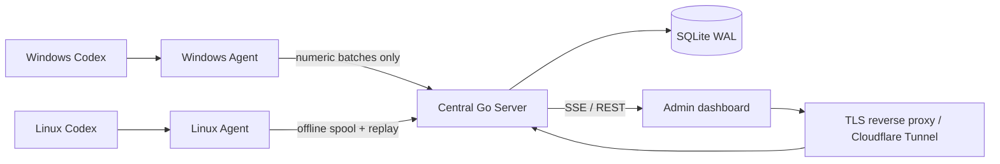

# Codex Token Meter

> A local-first, cross-platform, auditable Codex token usage dashboard.

[](https://github.com/shaoqiangxu/codex-token-meter/actions/workflows/ci.yml)
[](https://go.dev/)
[](LICENSE)

[中文](README.md) · [Configuration](docs/CONFIGURATION.md) · [Operations](docs/OPERATIONS.md) · [Security design](docs/SECURITY.md)

Codex Token Meter reads local session logs from Windows and Linux hosts running Codex CLI or Codex App. It extracts numeric usage and minimal display metadata, then presents usage by device, project, task, model, and reasoning effort. One cross-platform Go binary provides the server, agent, enrollment, backfill, backup, and restore commands.

The monitor **does not invoke an LLM API and does not consume tokens itself**. OpenAI API, Vercel, and Codex Credits values shown in the dashboard are deterministic local equivalents, not third-party bills.

> [!IMPORTANT]
> This is an unofficial community project and is not affiliated with OpenAI, Vercel, or Cloudflare. Local Codex log schemas may change. The project currently targets personal and small-team single-server deployments; it is not a multi-tenant billing system.

## Highlights

- Linux and Windows collection with a deployment-time baseline; old history is not imported by default.
- Correct positive-delta accounting for cumulative usage counters, including automatic epoch changes when a counter restarts inside the same rollout file.
- Stable event IDs, response/turn deduplication, archive-move handling, and parent/child task aggregation.
- Local SQLite checkpoints and an offline spool on every agent.
- SQLite WAL on the central server with online backups and retention.
- SSE live updates with REST polling fallback and in-place DOM patches that preserve expanded rows and selections.
- Project/repository and explicit Codex task-name metadata without reading conversation previews.
- Historical OpenAI/Vercel equivalent pricing, Codex Credits equivalents, and ECB USD/CNY reference rates.
- Loopback-only server binding, Argon2id admin authentication, CSRF protection, per-agent bearer tokens, and hardened systemd units.

## Data flow



Uploaded data is limited to random host/task identifiers, explicit task names, reduced project/repository names, model settings, timestamps, token counters, and parser quality metadata. Prompts, responses, reasoning bodies, tool output, source code, absolute paths, cookies, API keys, and full JSONL files are never uploaded.

## Quick start

Prerequisites: Go 1.25+, a Linux central host with systemd/SQLite/OpenSSL/curl/Python 3, and a TLS reverse proxy or Cloudflare Tunnel. Node.js is only needed for frontend tests.

```bash
sudo install -d -m 0755 -o "$(id -un)" -g "$(id -gn)" /opt/codex-token-meter
git clone https://github.com/shaoqiangxu/codex-token-meter.git /opt/codex-token-meter
cd /opt/codex-token-meter

go test ./...
go vet ./...
node tests/frontend_test.js

mkdir -p dist
CGO_ENABLED=0 GOOS=linux GOARCH=amd64 go build -trimpath -ldflags='-s -w' -o dist/codex-meter-linux-amd64 .
CGO_ENABLED=0 GOOS=linux GOARCH=arm64 go build -trimpath -ldflags='-s -w' -o dist/codex-meter-linux-arm64 .
CGO_ENABLED=0 GOOS=windows GOARCH=amd64 go build -trimpath -ldflags='-s -w' -o dist/codex-meter-windows-amd64.exe .

sudo env PUBLIC_URL='https://meter.example.com' PROJECT_DIR="$PWD" ./deploy/install-local.sh
sudo cat /etc/codex-token-meter/initial-admin-password
```

Route your TLS hostname to `http://127.0.0.1:8787`, sign in, and use the dashboard to generate a single-use, 15-minute enrollment command for each Windows or Linux host. Never expose port 8787 directly to the public network.

See the [Chinese README](README.md) for metric semantics, the full privacy boundary, deployment details, commands, limitations, and repository layout. See [configuration](docs/CONFIGURATION.md), [operations](docs/OPERATIONS.md), [pricing](docs/PRICING.md), and [security](docs/SECURITY.md) for focused references.

## Development

```bash
go test -race ./...
go vet ./...
node --check web/app.js
node tests/frontend_test.js
```

Do not attach real Codex sessions to issues or pull requests. Use minimal, synthetic, redacted schema fixtures.

## License

[MIT](LICENSE) © 2026 Codex Token Meter contributors
